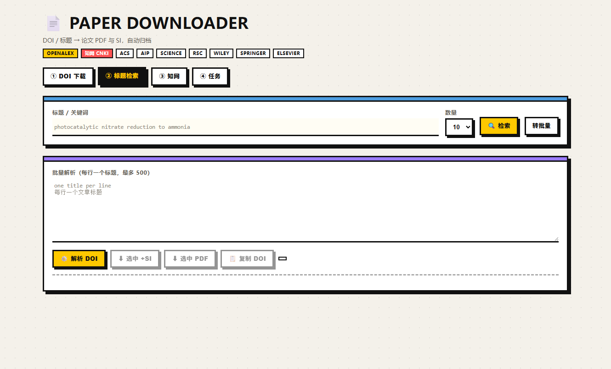
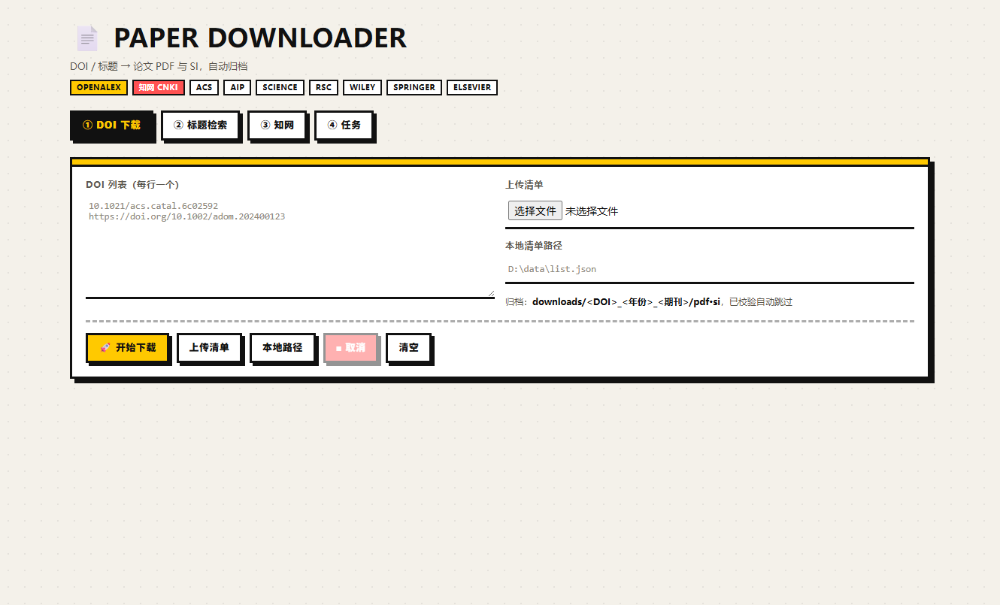
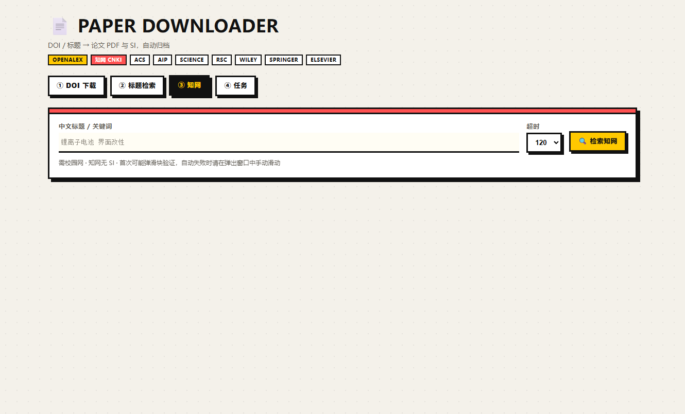
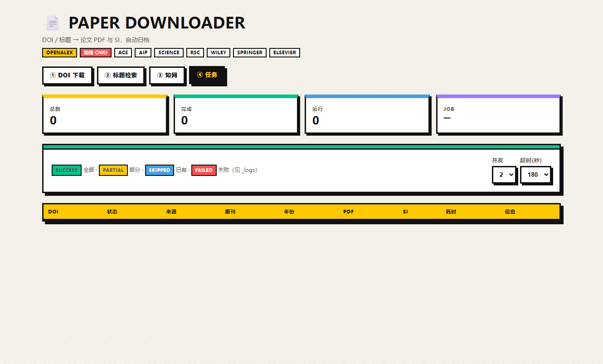

# ChemPaper Download

通过校园网权限自动下载论文正文（PDF）与补充材料（SI）。支持 DOI 批量下载、OpenAlex 学术标题检索、知网（CNKI）中文文献检索，提供桌面应用、Web 界面、命令行与 HTTP API 四种使用方式。

<div align="center">
  
</div>

[功能总览](#一功能总览) · [安装](#二安装) · [快速上手](#三快速上手) · [界面手册](#四图形界面使用手册) · [命令行](#五命令行手册) · [API](#六http-api-手册) · [归档规则](#七归档目录规则) · [配置参考](#八配置参考) · [故障排查](#九常见状态与故障排查) · [English](#english-version)

---

## 一、功能总览

| 出版社 / 数据源 | 正文 | 补充材料 SI | 说明 |
|---|---|---|---|
| ACS | ✅ | ✅ | 校园网权限，自动过 Cloudflare 挑战 |
| AIP Publishing | ✅ | ✅ | |
| AAAS / Science | ✅ | ✅ | |
| Royal Society of Chemistry | ✅ | ✅ | |
| Wiley | ✅ | ✅ | 自动使用 600 秒整篇预算 |
| Springer Nature / SpringerLink | ✅ | ✅ | |
| Elsevier / ScienceDirect | ✅ 官方 API | ✅ 公开 CDN | 需要配置 `ELSEVIER_API_KEY` |
| **CNKI 中国知网** | ✅ | ❌ 无 SI | 检索中文文献，提取 DOI 与中文标题，下载正文 PDF |
| **OpenAlex** | 🔍 仅检索 | — | 免费开源学术数据库，标题 → DOI 解析 |

无法识别的 DOI 会自动兜底路由到知网检索。SI 支持识别 PDF、ZIP、Office 文档、图片、视频等格式。同一 DOI 重复提交会自动跳过；只缺部分附件时保留已下载内容，只补缺失部分。

## 二、安装

要求：Windows 10/11、Python 3.11+、Microsoft Edge、校园网（或可访问出版社的网络）。Elsevier 官方 API 需要额外的 API key。

推荐使用独立 Conda 环境：

```powershell
git clone https://github.com/iceyfisher/chempaper_down.git
cd chempaper_down

conda create -n chem-paper-agent python=3.11 -y
conda activate chem-paper-agent

python -m pip install --upgrade pip
python -m pip install -e .
```

也可以先按 `requirements.txt` 装依赖再装本体：

```powershell
python -m pip install -r requirements.txt
python -m pip install -e . --no-deps
```

安装后共有 5 个入口命令：

| 命令 | 用途 |
|---|---|
| `paper-tool-app` | **桌面应用**（推荐，pywebview 原生窗口） |
| `paper-tool-server` | Web 服务（浏览器访问） |
| `paper-tool` | 命令行批量下载 |
| `paper-tool-agent` | 上游 AI Agent 客户端 |
| `paper-tool-worker` | 内部单 DOI 工作进程（勿直接调用） |

PowerShell 找不到命令时不必改 PATH，直接用绝对路径：

```powershell
& "$env:CONDA_PREFIX\Scripts\paper-tool-app.exe"
```

> 桌面窗口依赖 pywebview，随 `pip install -e .` 一起安装；若该包安装失败，`paper-tool-app` 会自动改用默认浏览器打开同一界面。

## 三、快速上手

三分钟下载第一篇论文：

1. 连接校园网，确认能打开出版社网页。
2. 启动：`paper-tool-app`（或 `paper-tool-server` 后访问 http://127.0.0.1:8765）。
3. 在 **① DOI 批量下载** 标签页粘贴一个 DOI，例如 `10.1021/acs.catal.6c02592`。
4. 点击 **🚀 开始批量下载**。页面自动跳到 **④ 任务与结果**，实时显示进度。
5. 完成后在 `downloads/<DOI>_<年份>_<期刊>/pdf/` 里找到正文 PDF。

## 四、图形界面使用手册

### 4.1 ① DOI 批量下载



**操作步骤**：左侧文本框粘贴 DOI（每行一个）→ 点击 **🚀 开始批量下载**。

支持三种输入方式：

| 方式 | 操作 | 支持格式 |
|---|---|---|
| 直接粘贴 | 文本框粘贴后点"开始批量下载" | `10.1021/xxx`、`https://doi.org/10.1002/xxx`，可混入其他文字（自动正则提取） |
| 上传清单 | 点"上传清单并开始" | TXT/MD、JSON、JSONL/NDJSON、CSV/TSV |
| 本地路径 | 填路径后点"读取路径并开始" | 同上（路径需服务进程可访问） |

清单文件示例：

```text
# list.txt —— 每行一个 DOI，# 开头的注释会被忽略
10.1021/acs.catal.6c02592
https://doi.org/10.1002/adom.202400123
```

```json
// list.json —— 自动递归查找 doi / DOI / doiUrl 字段
{
  "query": "photocatalysis",
  "papers": [
    {"doi": "10.1039/d6qo00853d", "score": 0.95},
    {"doi": "10.1007/s11244-024-01234-5"}
  ]
}
```

```csv
title,doi
Example A,10.1021/acs.joc.0000001
```

**参数**（在 ④ 任务与结果 页设置，对所有提交方式生效）：

- **并发**：同时运行的浏览器子进程数量（1–4）。50 篇以上的大批量建议从 2 开始，确认网络与内存稳定后再提到 3–4。
- **硬超时**：单篇最长等待（180/210/240 秒）。大附件或慢网络选更长；Wiley 与 Elsevier 内部固定 600 秒预算，不受此选项影响。

### 4.2 ② 学术标题检索（OpenAlex）


**单条检索**：输入文章标题或关键词 → 点击 **🔍 检索** → OpenAlex 返回相关度排序的结果列表。

每条结果包含标题、年份、期刊、被引次数、OA 标记，以及三个固定按钮：

| 按钮 | 行为 |
|---|---|
| 📋 **复制 DOI** | 复制该条目的 DOI |
| ⬇ **下载原文** | 提交下载任务，**跳过 SI 扫描**（更快，状态可达 success） |
| 🧪 **下载原文+SI** | 提交下载任务，同时下载正文与全部补充材料 |

点击下载按钮会弹出确认框，确认后自动创建任务并跳到结果页。

**高通量批量解析**（下方紫色卡片）：适合手头有一批纯标题的场景。

1. 文本框内**一行一个标题**粘贴（最多 500 条）。
2. 点击 **⚙️ 批量解析 DOI**，确认后逐条请求 OpenAlex（每条约 0.2 秒，500 条约 2 分钟）。
3. 解析结果逐行显示匹配标题、DOI 与**相似度徽章**（绿色 = 高置信匹配，红色 = 相似度低于 0.72 的存疑匹配，建议人工核对）。
4. 使用底部按钮整批操作：**下载选中（原文+SI）**、**下载选中（仅原文）**、**复制选中 DOI**。

> 提示：在单条检索框输入内容后点 **转批量**，可把当前关键词直接带入批量输入框。中文标题在 OpenAlex 覆盖有限，请改用 ③ 知网检索。

**连接策略（自动）**：OpenAlex 请求依次尝试 ①环境代理 → ②直连 → ③国内 DoH 解析 + IP 直连（SNI 保持域名），任一通路成功即缓存复用。无论你的网络需要代理还是 DNS 受限，都无需手动配置。

### 4.3 ③ 知网检索（CNKI）



**前置条件**：已连接校园网且机构拥有知网访问权限；`kns.cnki.net` 可达。

**操作步骤**：

1. 输入中文标题或关键词（如 `锂离子电池 界面改性`）。
2. 点击 **🔍 检索知网** 并确认。
3. 程序弹出独立的 Edge 窗口访问知网。若出现滑块验证，先自动求解；**自动失败时请在该窗口中手动滑动滑块**，程序检测到验证通过后自动继续（默认等待 120 秒，可用 `PAPER_TOOL_CNKI_MANUAL_WAIT` 调整）。
4. 每条结果提供 **复制 DOI** 与 **下载原文**；知网文章没有 SI，不提供 SI 按钮。

说明：

- 知网使用持久化浏览器配置（`downloads/_browser_profile/`），验证通过后的一段有效期内后续检索不再弹验证。
- 检索结果会尝试提取 DOI；**没有登记 DOI 的中文文章也能直接下载**——程序通过文章页直链完成 PDF/CAJ 下载。
- 提取到的 DOI 与中文标题会写入归档结果（`downloads/_manifests/`）。
- 检索与下载互不影响：检索只读页面，下载走完整的单篇子进程管线（同样有头 + 验证处理）。

### 4.4 ④ 任务与结果



提交任何任务后此页自动轮询（每 2.5 秒刷新），显示每篇论文的 DOI、状态、来源出版社、期刊、年份、正文/SI 计数、耗时与阶段信息。顶部四张卡片为任务总数 / 已完成 / 运行中 / 当前 Job 编号；**■ 取消当前 Job** 会终止所有活动子进程及其 Edge 进程树。

## 五、命令行手册

直接提交 DOI：

```powershell
paper-tool `
  --dois "10.1039/d6qo00853d,10.1021/acscatal.6c02592" `
  --concurrency 2 `
  --article-timeout 180 `
  --download-root .\downloads
```

从清单文件读取：

```powershell
paper-tool `
  --input .\example_doi_list.txt `
  --concurrency 2 `
  --article-timeout 180 `
  --download-root .\downloads `
  --json-output .\download_results.json
```

JSON 清单指定字段名（默认 `doi`）：

```powershell
paper-tool --input .\example_agent_manifest.json --doi-field doi
```

全部参数：

| 参数 | 默认 | 说明 |
|---|---|---|
| `--input` / `--dois` | 二选一必填 | 清单文件路径 / 逗号分隔 DOI 文本 |
| `--doi-field` | `doi` | JSON/CSV 清单中的 DOI 字段名 |
| `--download-root` | `downloads` | 归档根目录 |
| `--concurrency` | `2` | 并发子进程数（1–4） |
| `--article-timeout` | `120` | 单篇硬超时（秒） |
| `--json-output` | 无 | 结果 JSON 输出路径 |

## 六、HTTP API 手册

服务启动后（默认 `http://127.0.0.1:8765`）可用以下接口编程调用。

### 6.1 检索

```bash
# OpenAlex 相关性检索
curl "http://127.0.0.1:8765/api/search/academic?q=photocatalytic%20nitrate%20reduction&limit=5"

# 批量标题 → DOI 解析（返回相似度与 resolved 标记）
curl -X POST http://127.0.0.1:8765/api/search/academic/batch ^
  -H "Content-Type: application/json" ^
  -d "{\"titles\":[\"Article title one\",\"Article title two\"]}"

# 知网检索（独立浏览器子进程，可能耗时 30-120 秒）
curl "http://127.0.0.1:8765/api/search/cnki?q=锂离子电池界面改性&timeout=120"
```

### 6.2 提交下载

```bash
# 文本批量提交（自动正则提取 DOI）
curl -X POST http://127.0.0.1:8765/api/jobs ^
  -H "Content-Type: application/json" ^
  -d "{\"doi_text\":\"10.1021/acs.catal.6c02592\",\"download_si\":true}"

# 按条目提交（检索结果 → 一键下载；每条可独立控制 SI 与提示信息）
curl -X POST http://127.0.0.1:8765/api/jobs/items ^
  -H "Content-Type: application/json" ^
  -d "{\"items\":[{\"doi\":\"10.1021/acs.catal.6c02592\",\"download_si\":false}]}"

# 上传清单 / 本地路径 / Agent 清单
curl -X POST "http://127.0.0.1:8765/api/jobs/upload?download_si=true" -F "file=@list.txt"
curl -X POST http://127.0.0.1:8765/api/jobs/path -H "Content-Type: application/json" ^
  -d "{\"input_path\":\"D:\\\\data\\\\list.json\",\"doi_field\":\"doi\"}"
curl -X POST http://127.0.0.1:8765/api/agent/jobs ^
  -H "Content-Type: application/json" ^
  -d "{\"input_path\":\"D:\\\\data\\\\search_batch.json\",\"job_tag\":\"batch-01\"}"
```

`/api/jobs/items` 的每个条目字段：

| 字段 | 必填 | 说明 |
|---|---|---|
| `doi` | ✅ | DOI，或 `cnki:<文章页URL>` 直链键 |
| `title_query` | ❌ | 标题提示（知网检索备用） |
| `article_url` | ❌ | 文章页直链（知网跳过搜索直达下载） |
| `download_si` | ❌ 默认 `true` | 条目级 SI 开关，覆盖任务级设置 |

### 6.3 轮询与取消

```bash
curl http://127.0.0.1:8765/api/jobs/<job_id>            # 任务状态
curl http://127.0.0.1:8765/api/jobs/<job_id>/results    # 全部条目结果
curl -X POST http://127.0.0.1:8765/api/jobs/<job_id>/cancel
```

Job 状态机：`queued → running → completed | failed | cancelled`。单篇条目终态见第九节。

### 6.4 其他

- `GET /api/health`：版本、架构与出版社列表。
- 上游 AI Agent 对接规范见 [AGENT.md](AGENT.md)。

## 七、归档目录规则

每篇文章一个独立目录，目录名 = `DOI_年份_期刊`，内含 `pdf/` 与 `si/` 两个子文件夹：

```text
downloads/
├─ 10.1021_acs.catal.6c02592_2026_ACS Catalysis/
│  ├─ pdf/                                    # 正文：<doi>.pdf
│  └─ si/                                     # SI：<doi>_si_<url哈希>.<扩展名>
├─ 10.19799_j.cnki.2095-4239.2023.0001_2023_储能科学与技术/
│  └─ pdf/                                    # 知网文章只有正文
├─ _jobs/          # 任务状态 JSON（重启后仍可查看）
├─ _logs/          # 每个子进程的完整日志
├─ _manifests/     # 每篇论文的最终结果清单（排查用）
├─ _search_runs/   # 知网检索子进程的原始结果
└─ _worker_runs/   # 子进程工作目录（request/result）
```

- 年份取自出版社页面 citation 元数据（`citation_publication_date` 等）或 Elsevier `coverDate`；取不到时为 `unknown`。
- **旧版目录完全兼容**：旧结构 `<出版社 - 期刊>/paper/` 中的已下载文件仍会被重复检查识别，不会重复下载。
- 重复提交规则：正文 + SI 全部校验通过 → `skipped_duplicate` 直接跳过；只缺 SI → 保留正文，仅补 SI。

## 八、配置参考

长期配置写入项目根目录 `.env`（已被 Git 忽略），服务与子进程自动读取；已存在的系统环境变量优先。

| 变量 | 默认 | 说明 |
|---|---|---|
| `ELSEVIER_API_KEY` | 无 | Elsevier 官方 Article Retrieval API 密钥（仅 Elsevier 需要） |
| `OPENALEX_MAILTO` | 无 | 你的邮箱，进入 OpenAlex polite pool 获得更稳定限流 |
| `PAPER_TOOL_DOWNLOAD_ROOT` | `downloads` | 归档根目录 |
| `PAPER_TOOL_CONCURRENCY` | `2` | 默认并发 |
| `PAPER_TOOL_ARTICLE_TIMEOUT` | `120` | 常规单篇硬超时（秒） |
| `PAPER_TOOL_WILEY_TIMEOUT` | `600` | Wiley 单篇预算 |
| `PAPER_TOOL_ELSEVIER_TIMEOUT` | `600` | Elsevier 单篇预算 |
| `PAPER_TOOL_NAV_TIMEOUT` | `30` | 页面导航软超时 |
| `PAPER_TOOL_NATIVE_TIMEOUT` | `35` | 原生下载等待 |
| `PAPER_TOOL_BLOB_TIMEOUT` | `75` | 页内 fetch/Blob 下载等待 |
| `PAPER_TOOL_CLOUDFLARE_TIMEOUT` | `30` | Cloudflare 挑战处理等待 |
| `PAPER_TOOL_ENABLE_CLOUDFLARE_HELPER` | `1` | 是否启用 Pydoll Cloudflare 助手 |
| `PAPER_TOOL_KILL_GRACE` | `5` | 子进程终止宽限（秒） |
| `PAPER_TOOL_CNKI_MANUAL_WAIT` | `120` | 知网滑块验证自动失败后等待人工滑动的时间（秒） |

`.env` 示例：

```dotenv
ELSEVIER_API_KEY=your-key
PAPER_TOOL_ELSEVIER_TIMEOUT=600
OPENALEX_MAILTO=you@example.com
```

> API key 只通过服务进程环境传递给子进程，不会写入源码、结果 JSON 或 `_worker_runs/request.json`。

## 九、常见状态与故障排查

### 条目状态含义

| 状态 | 含义 | 处理建议 |
|---|---|---|
| `success` | 正文与全部 SI 下载并校验通过 | 无需处理 |
| `partial` | 正文或部分 SI 成功，仍有缺失 | 查看 manifest 的 `error` 字段定位失败附件，重新提交只补缺失 |
| `skipped_duplicate` | 已下载且校验完整，自动跳过 | 正常 |
| `failed` | 未获得有效结果 | 看 `_logs/<doi>_<run>.log`；常见为权限不足、验证码、页面改版 |
| `timeout` | 超过整篇硬预算被终止 | 提高超时或降低并发后重试 |
| `browser_crashed` | Pydoll/Edge 连接中断 | 直接重试；持续出现则降并发为 1 |
| `process_error` | 子进程异常退出无结果 | 查看 log 末尾 traceback |

### FAQ

**`paper-tool-server` / `paper-tool-app` 无法识别**：Conda 环境未激活，或用 `& "$env:CONDA_PREFIX\Scripts\paper-tool-server.exe"` 直接运行。

**任务一直 `running` 不结束**：单篇超过硬超时后父进程会强制终止子进程与 Edge（最长再等 5 秒），最终一定落到终态；大批量时优先降并发。

**Edge 卡住或页面很慢**：并发降为 1，超时调到 210/240 秒。Wiley 固定 600 秒预算，调 GUI 超时对它无效。

**Elsevier 提示 API key 相关失败**：确认启动服务的同一终端已设置 `ELSEVIER_API_KEY`（或写入 `.env`）；401/403 表示 key 无 Article Retrieval 权限。

**知网检索/下载失败**：确认校园网可达知网且机构已授权。知网的滑块验证会先自动求解；失败时会在弹出的 Edge 窗口等待人工滑动（默认 120 秒），滑动通过后自动继续。多次失败可稍等几分钟后重试，或调大 `PAPER_TOOL_CNKI_MANUAL_WAIT`。无 DOI 文章请从知网检索结果点"下载原文"（走文章页直链）。

**OpenAlex 提示 ConnectError**：程序已内置"环境代理 → 直连 → DoH+IP 直连"三级自动回退。若仍失败，请确认 `api.openalex.org` 在当前网络下可达（开/关代理各试一次），并在 `.env` 配置 `OPENALEX_MAILTO` 进入 polite pool。

**下载的 PDF 打不开**：查看 `_manifests/<doi>.json` 中该文件的 `error`（如 `html_instead_of_file` 表示拿到的是权限拦截页），重新提交即可增量补下。

---

## English Version

### Overview

Automated article PDF + Supporting Information (SI) downloader over campus-network entitlements, with DOI batch download, OpenAlex title search, and CNKI (知网) search for Chinese literature. Ships as a desktop app (pywebview), a web UI, a CLI and an HTTP API.

| Source | PDF | SI | Notes |
|---|---|---|---|
| ACS / AIP / AAAS / RSC / Wiley / Springer | ✅ | ✅ | Browser adapters, Cloudflare-aware |
| Elsevier | ✅ official API | ✅ public CDN | requires `ELSEVIER_API_KEY` |
| CNKI | ✅ | ❌ | DOI + Chinese title extraction, main PDF only |
| OpenAlex | 🔍 search only | — | free title → DOI resolution |

### Install

```powershell
git clone https://github.com/iceyfisher/chempaper_down.git
cd chempaper_down
conda create -n chem-paper-agent python=3.11 -y
conda activate chem-paper-agent
python -m pip install -e .
```

Requires Windows 10/11, Python 3.11+, Microsoft Edge and campus-network access.

### Entry points

| Command | Purpose |
|---|---|
| `paper-tool-app` | Native desktop window (pywebview; falls back to the default browser) |
| `paper-tool-server` | Web UI + API at http://127.0.0.1:8765 |
| `paper-tool` | CLI batch downloader |

### Web UI

Four tabs: **① DOI batch download** (paste TXT/JSON/JSONL/CSV lists; concurrency 1–4; hard timeout 180/210/240 s), **② OpenAlex title search** (every row offers Copy DOI / Download PDF / Download PDF+SI; batch box resolves up to 500 titles with similarity scores), **③ CNKI search** (isolated Edge subprocess, Copy DOI + Download PDF, no SI by design), **④ Jobs & results** (live polling, cancel support).

### CLI

```powershell
paper-tool --dois "10.1021/acs.catal.6c02592" --concurrency 2 --article-timeout 180 --download-root .\downloads
paper-tool --input .\example_doi_list.txt --json-output .\results.json
paper-tool --input .\manifest.json --doi-field doi
```

### API

```bash
GET  /api/search/academic?q=<query>&limit=10          # OpenAlex search
POST /api/search/academic/batch {"titles":[...]}      # batch title → DOI
GET  /api/search/cnki?q=<query>&timeout=120           # CNKI search (subprocess)
POST /api/jobs             {"doi_text":"...", "download_si":true}
POST /api/jobs/items       {"items":[{"doi":"...","download_si":false}]}
POST /api/jobs/upload | /api/jobs/path | /api/agent/jobs | /api/agent/content
GET  /api/jobs/{id} · GET /api/jobs/{id}/results · POST /api/jobs/{id}/cancel
```

### Archive layout

```text
downloads/<doi>_<year>_<journal>/pdf|si
downloads/_jobs | _logs | _manifests | _search_runs | _worker_runs
```

The year comes from citation meta tags or the Elsevier coverDate (`unknown` if unavailable). The legacy `<Publisher - Journal>/paper/` layout is still recognized by the duplicate check.

### Configuration

All settings live in `.env` (Git-ignored): `ELSEVIER_API_KEY`, `OPENALEX_MAILTO`, `PAPER_TOOL_DOWNLOAD_ROOT`, `PAPER_TOOL_CONCURRENCY`, `PAPER_TOOL_ARTICLE_TIMEOUT`, `PAPER_TOOL_WILEY_TIMEOUT`, `PAPER_TOOL_ELSEVIER_TIMEOUT`, `PAPER_TOOL_NAV_TIMEOUT`, `PAPER_TOOL_NATIVE_TIMEOUT`, `PAPER_TOOL_BLOB_TIMEOUT`, `PAPER_TOOL_CLOUDFLARE_TIMEOUT`, `PAPER_TOOL_ENABLE_CLOUDFLARE_HELPER`, `PAPER_TOOL_KILL_GRACE`, `PAPER_TOOL_CNKI_MANUAL_WAIT`. Existing system environment variables take precedence.

### Statuses & troubleshooting

`success` · `partial` (inspect `downloads/_manifests/<doi>.json`) · `skipped_duplicate` · `failed` (see `downloads/_logs`) · `timeout` · `browser_crashed` (retry, then lower concurrency) · `process_error`. For Elsevier 401/403 check the API key entitlement; for CNKI failures verify campus entitlement and solve the CAPTCHA once manually.
